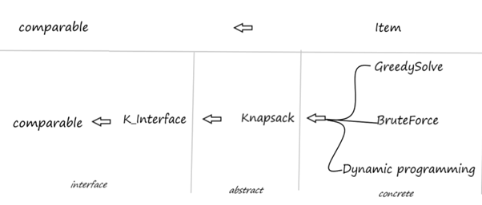
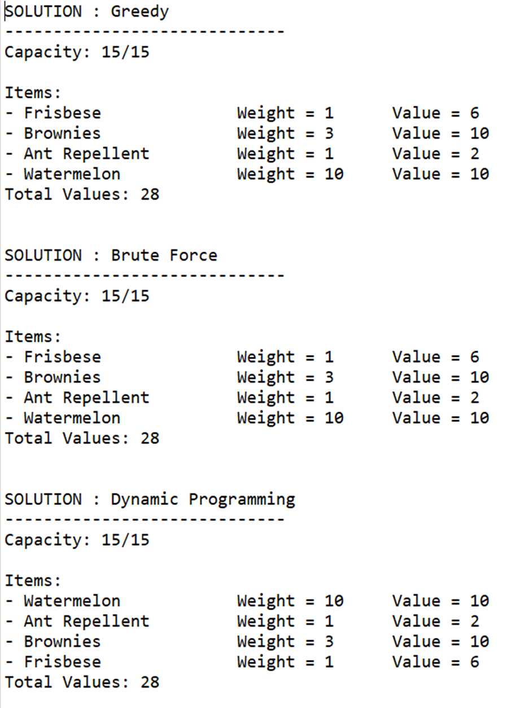

# Knapsack Problem

This repository contains solutions to the knapsack problem, implemented in Java. 

## Problem Statement

The knapsack problem involves selecting a set of items to maximize the total value without exceeding a given capacity. Each item has a specific weight and value, and the goal is to determine the optimal number of each item to include in the knapsack. 

For instance, **Picnic Planning**: For a picnic with a knapsack capacity of 15 pounds, a list of items with associated weights and ratings is provided. The objective is to choose items based on their ratings, ensuring the total weight does not exceed the knapsack's capacity.

### Algorithms Implemented

The repository includes implementations of the following algorithms to solve the knapsack problem:

- **Brute Force Algorithm**: Evaluates all possible combinations of items to find the optimal solution.
- **Greedy Algorithm**: Selects items based on the highest value-to-weight ratio until the knapsack is full.
- **Dynamic Programming**: Divides the complex problem into smaller sub-problems that requires minimal calculation. Instead of solving the same sub-problems repeatedly as in recursion, this method stores the results of sub-problems and uses them to build up the final solution efficiently.


## Data Structure
`K_interface` is an interface that will be implemented by the `Knapsack` abstract class. Additionally, `K_interface` extends the `Comparable` interface. Each selected algorithm will implement the `Knapsack` class to perform their respective operations.
<p align="center">
  
</p>

## Setup

1. **Create Java Application**: Use the Eclipse IDE to create a new Java application project.
2. **Class Files**:
   - Create one class for each Java file: `Knapsack.java`: The template for the knapsack container, `Item.java`: The template for holding item information.
3. **Modify Input**: Adjust the input items as necessary within the code.
4. **Execute the Program**: Run the program in Eclipse to see the results of the implemented algorithms.

## Program Output

### Sample Input

The following array represents a set of items used to test the knapsack algorithm:

```java
Item[] items = {
    new Item("Ant Repellent", 1, 2),
    new Item("Blanket", 4, 3),
    new Item("Brownies", 3, 10),
    new Item("Frisbee", 1, 6),
    new Item("Salad", 5, 4),
    new Item("Watermelon", 10, 10)
};
```
### Result and Discussion

<p align="center">
  
</p>

**Algorithm Performance**
<center>
<table>
  <thead>
    <tr>
      <th align="center">Algorithm</th>
      <th align="center">Time Complexity</th>
      <th align="center">Output Order</th>
      <th align="center">Total Capacity</th>
      <th align="center">Total Values</th>
    </tr>
  </thead>
  <tbody>
    <tr>
      <td align="center">Greedy</td>
      <td align="center">O(n^2)</td>
      <td align="center">2 (average case)</td>
      <td align="center">15/15</td>
      <td align="center">28</td>
    </tr>
    <tr>
      <td align="center">Brute Force</td>
      <td align="center">O(n2^n)</td>
      <td align="center">3 (worst case)</td>
      <td align="center">15/15</td>
      <td align="center">28</td>
    </tr>
    <tr>
      <td align="center">Dynamic Programming</td>
      <td align="center">O(n)</td>
      <td align="center">1 (best case)</td>
      <td align="center">15/15</td>
      <td align="center">28</td>
    </tr>
  </tbody>
</table>
</center>


In the knapsack problem analysis, all three algorithms—Greedy, Brute Force, and Dynamic Programming—achieve the same total values with the maximum capacity load. However, the Dynamic Programming algorithm stands out for its efficiency. With a linear time complexity of O(n), it outperforms the Greedy algorithm's quadratic complexity of O(n^2) and the Brute Force algorithm's exponential complexity of O(n*2^n). Dynamic Programming effectively breaks the problem into smaller, manageable parts, solving it with a single loop. Conversely, the Brute Force algorithm's execution time grows exponentially with input size, while the Greedy algorithm’s time complexity increases quadratically.

## Contributors
-  Vicrace Chan Jia Lin
-  Goh Wai Siang
-  Tan Eong Seang
